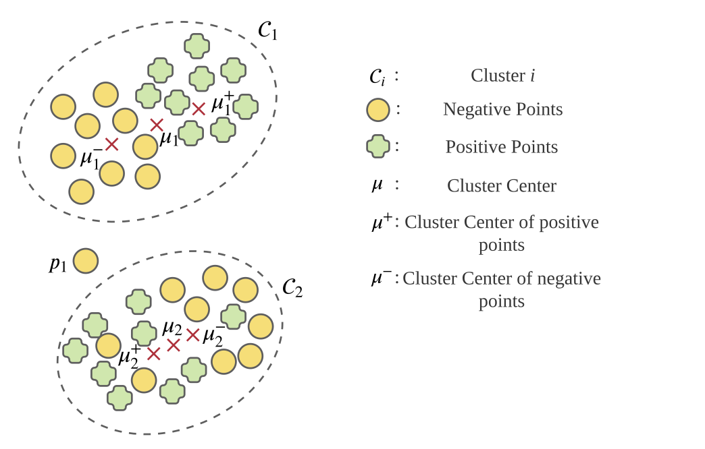

CAC
======

CAC is a clustering based framework for classification.

Training Phase:
===============

`clusters, models, alt_labels, errors, seps, loss = cac(X_train, labels, 10, np.ravel(y_train), alpha, beta, classifier="LR")`

## Input:
- `X_train`: The input data which is a normalized numpy matrix.
- `labels`: A user-defined clustering of training data points. Random clustering: `labels = np.random.randint(0, n_clusters, [len(X_train)])`
- `y_train`: The binary labels of input data points
- `alpha`: Hyperparameter
- `beta`: Gradient cutoff parameter. Set to -np.infty
- `classifier`: The choice of base classifier. Choose from
	LR: Logistic Regression
	RF: Random Forest with 10 estimators
	SVM: Linear SVM
	Perceptron: Linear Perceptron
	ADB: AdaBoost
	DT: Decision Tree

<!--- `µ+`, `µ-` and `µ`)     ||x_i - µ||^2 - alpha * ||µ+ - µ-||^2 --->

## Output:
- `clusters`: the cluster centroids (,  and ) for all clusters and their F1/RoC values
- `models`: The trained models
- `alt_labels`: the labels for all testing points in all iterations
- `errors`: The unsupervised loss of CAC for every iteration
- `seps`: The sum of inter-class distances of all clusters for every iteration
- `loss`: The supervised loss of the models trained in every iteration

Testing/Evaluation Phase:
=========================

`test_scores = score(X_test, y_test, models, clusters[1], alt_labels, alpha, flag="normal", verbose=True)[1:3]`

## Input:
- `X_test`: The testing data
- `y_test`: The labels of test data. Used to compare with the test predictions to obtain the scores
- `clusters[1]`: The cluster centroids obtained in the training phase
- `alt_labels`: The cluster labels obtained in the training phase
- `alpha`: Hyperparameter
- `flag`: This flag decides how the points are assigned to the training clusters.
	"cac": Compute nearest centroid using the 
	"Normal": Compute nearest centroid using normal euclidean distance
- `verbose`: Get performance metrics for all the epochs 

## Output:
- `test_scores`: An array of arrays containing Accuracy, F1, AUC, Specificity and Sensitivity scores for every iteration. The first value in every array has the performance metric for classifiers trained on the input clusters given by the user.
